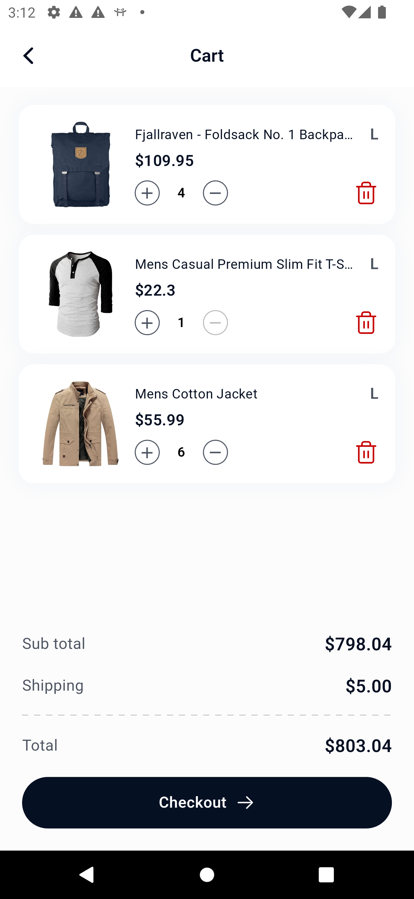
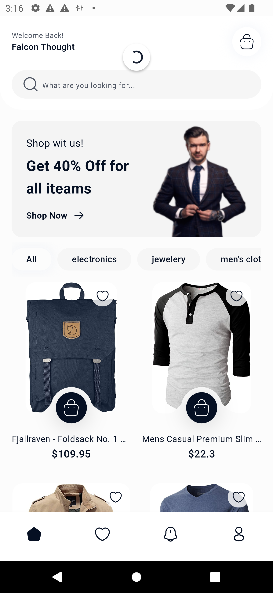
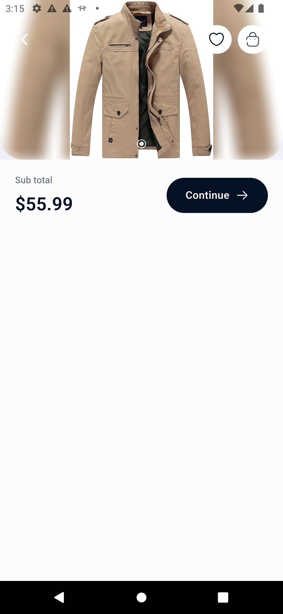
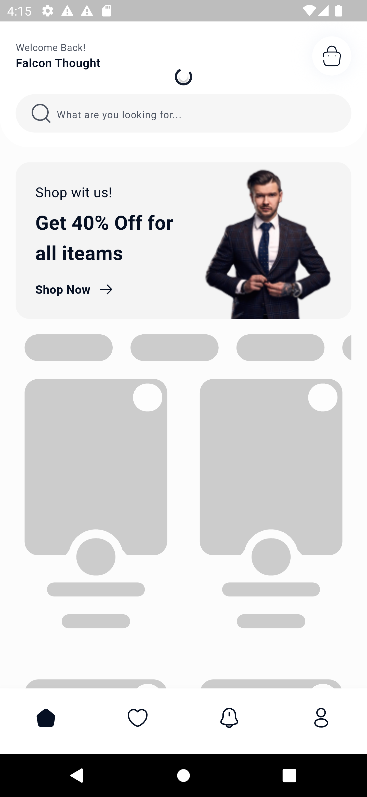
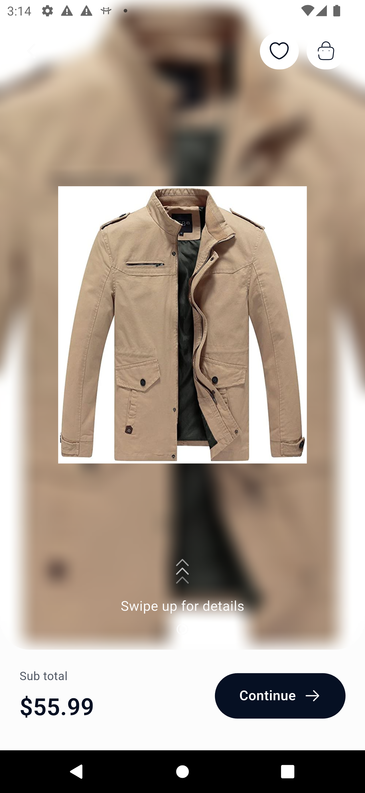

# 🛍️ Flutter E-Commerce App

## 📌 Overview
This is a Flutter-based e-commerce application developed as part of the Dubisign assessment. The app replicates a Figma UI and integrates with FakeStoreAPI to provide a seamless shopping experience. It supports offline functionality, smooth animations, and follows clean architecture principles.

## 📸 Screenshots  
| Home Screen  | Product Details | Cart |
|--------------|-----------------|------|
|          |     |  |
|  |  |                                      |
|  |          |                                      |

## ✨ Features
- **Figma UI Replication**: Implemented product grid, cart screen, and swipe gestures  
  [Figma design](https://www.figma.com/design/3OmE2oijKrshGrVkivPp3L/E-commerce-Clothing-App-(Community)?node-id=1-22&t=pTwZZDWrqBcwTZFA-1).
- **API Integration**: Fetches real-time product & category data from [FakeStoreAPI](https://fakestoreapi.com/).
- **Offline Support**: Uses `Hive` to store data locally and `connectivity_plus` to check network status.
- **State Management**: Managed using `BLoC (Cubit)`.
- **Animations & UX Enhancements**:
  - `Hero` animation for product details transition.
  - `Fade` animation on the swipe-up screen.
  - `SlideTransition` animation when removing items from the cart.
  - `Shimmer` effect for product/category loading.
- **Pull to Refresh**: Implemented using `pull_to_refresh_flutter3`.
- **Responsive UI**: Utilized `flutter_screenutil` for adaptive sizing.
- **Unit & Widget Testing**:
  - Unit tests for `home_remote_datasource`, `product_remote_datasource`, and `cart_remote_datasource`.
  - Widget test for `CustomCartItemQuantityRow` to ensure quantity buttons function correctly.

## 📌 Prerequisites  
Before running the project, ensure you have the following installed:
- Flutter SDK 3.x.x  
- Dart 3.x.x  
- Android SDK / Xcode (for running on an emulator or physical device)  

## 🏠 Tech Stack
- **Flutter**: Cross-platform framework
- **Dart**: Programming language
- **State Management**: BLoC (Cubit)
- **Networking**: Dio
- **Local Storage**: Hive
- **UI Enhancements**: Shimmer, Hero, SlideTransition
- **Testing**: Flutter Test, Mockito

## 🚀 Installation & Setup  
1. **Clone the repository:**  
   ```sh
   git clone https://github.com/ZainabElSawy/dubisign_task.git
   cd flutter-ecommerce
   ```
2. **Install dependencies:**  
   ```sh
   flutter pub get
   ```
3. **Run the app:**  
   - **Android:**  
     ```sh
     flutter run
     ```
   - **iOS:** (Ensure `pod install` is run inside `ios/`)  
     ```sh
     cd ios && pod install && cd ..
     flutter run
     ```

## 🧪 Running Tests  
This project includes **unit tests** and **widget tests**:  
- **Unit tests:** `home_remote_datasource`, `product_remote_datasource`, and `cart_remote_datasource`.  
- **Widget tests:** `CustomCartItemQuantityRow` (ensures increment & decrement functionality).  

Run all tests:  
```sh
flutter test
```

## 📺 Project Structure
```
lib/
├── core/
│   ├── errors/
│   ├── functions/
│   ├── services/
│   ├── utils/
│   ├── widgets/
│   ├── assets.dart
├── features/
│   ├── home/
│   ├── cart/
│   ├── product/
├── main.dart
```

## 🔮 Future Improvements  
- Implement user authentication (login/signup).  
- Improve error handling and UI messages.  
- Add more animations for better user experience.  

## 📝 License  
This project is for assessment purposes only.

---

Developed by **Zainab** 🚀

